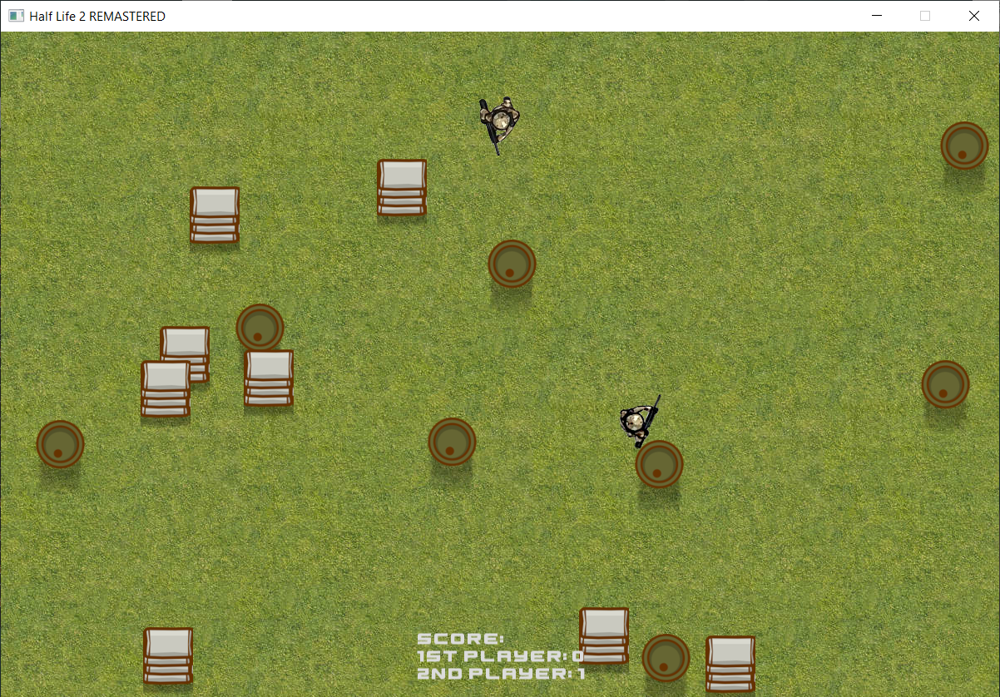

# Simple-Shooter-Game
 
A Simple game to practice object oriented programming methodology such as encapsulation, inheritance and abstraction. Also, the some of the structures of the game programming were experienced e.g. game loop, handling charachter's states. 

This project was done under the scope of *Object Oriented Programming Course*. 

[Download](https://github.com/eneserdo/Simple-Shooter-Game/releases/download/v0.1/Simple-Shooter-Game.rar)

## Usage

* First player:
  * Direction keys: <kbd>W, A, S, D</kbd>
  * Fire: <kbd> Enter </kbd>

* Second player:
  * Direction keys: <kbd>Up, Left, Down, Right </kbd>
  * Fire: <kbd> Space </kbd>

## Gameplay

